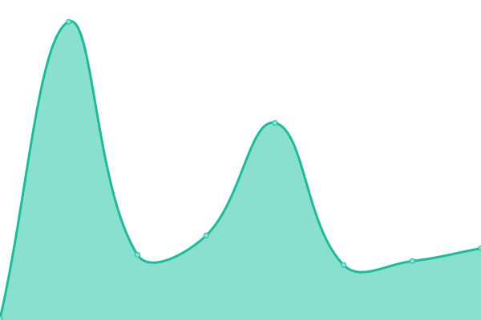
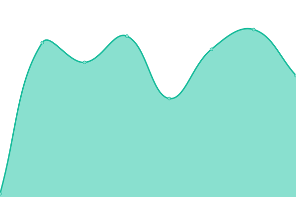

# [📈 Live Status](https://monitoring-apps.github.io/qc.app): <!--live status--> **🟩 All systems operational**

This repository contains the open-source uptime monitor and status page for [monitoring-apps](https://monitoring-apps.github.io/qc.app), powered by [Upptime](https://github.com/upptime/upptime).

With [Upptime](https://upptime.js.org), you can get your own unlimited and free uptime monitor and status page, powered entirely by a GitHub repository. We use [Issues](https://github.com/monitoring-apps/qc.app/issues) as incident reports, [Actions](https://github.com/monitoring-apps/qc.app/actions) as uptime monitors, and [Pages](https://monitoring-apps.github.io/qc.app) for the status page.

<!--start: status pages-->
<!-- This summary is generated by Upptime (https://github.com/upptime/upptime) -->
<!-- Do not edit this manually, your changes will be overwritten -->
<!-- prettier-ignore -->
| URL | Status | History | Response Time | Uptime |
| --- | ------ | ------- | ------------- | ------ |
|  [Quirk Club Institutional](https://quirkclub.io) | 🟩 Up | [quirk-club-institutional.yml](https://github.com/monitoring-apps/qc.app/commits/HEAD/history/quirk-club-institutional.yml) | 

 121ms
     
 | 

<a href="https://status.quirkclub.io/history/quirk-club-institutional">100.00%</a>
    

|  [Quirk Club Argentina](https://quirkclub.app) | 🟩 Up | [quirk-club-argentina.yml](https://github.com/monitoring-apps/qc.app/commits/HEAD/history/quirk-club-argentina.yml) | 

 3542ms
     
 | 

<a href="https://status.quirkclub.io/history/quirk-club-argentina">100.00%</a>
    

|  [Quirk Club Argentina (API endpoint)](https://us-central1-quirkclub-dev.cloudfunctions.net/api/check/api) | 🟩 Up | [quirk-club-argentina-api-endpoint.yml](https://github.com/monitoring-apps/qc.app/commits/HEAD/history/quirk-club-argentina-api-endpoint.yml) | 

 3130ms
     
 | 

<a href="https://status.quirkclub.io/history/quirk-club-argentina-api-endpoint">99.56%</a>
    

|  [Quirk Club Argentina (Payment Gateway)](https://us-central1-quirkclub-dev.cloudfunctions.net/api/check/payment-gateway-ml) | 🟩 Up | [quirk-club-argentina-payment-gateway.yml](https://github.com/monitoring-apps/qc.app/commits/HEAD/history/quirk-club-argentina-payment-gateway.yml) | 

 419ms
     
 | 

<a href="https://status.quirkclub.io/history/quirk-club-argentina-payment-gateway">100.00%</a>
    

|  [Quirk Club Argentina (SSR)](https://quirkclub-dev.web.app/ssr-check) | 🟩 Up | [quirk-club-argentina-ssr.yml](https://github.com/monitoring-apps/qc.app/commits/HEAD/history/quirk-club-argentina-ssr.yml) | 

 2958ms
     
 | 

<a href="https://status.quirkclub.io/history/quirk-club-argentina-ssr">99.46%</a>
    

<!--end: status pages-->

[**Visit our status website →**](https://monitoring-apps.github.io/qc.app)

## 📄 License

- Powered by: [Upptime](https://github.com/upptime/upptime)
- Code: [MIT](./LICENSE) © [monitoring-apps](https://monitoring-apps.github.io/qc.app)
- Data in the `./history` directory: [Open Database License](https://opendatacommons.org/licenses/odbl/1-0/)
